## Outline {.smaller}

1. **The cascade idea** — why and what
2. **Setup** — doubly-resonant metasurface
3. **Theory** — TCMT, adiabatic elimination, bandwidth sum rule
4. **Comparison with native $\chi^{(3)}$ resonance** — SPM, bistability, FWM, XPM, sign tunability
5. **Cascade-only capabilities** — saturable absorber, AM modulator, optical limiter, sensor
6. **Feasibility** — host materials, bulk vs metasurface
7. **Design knobs** — what the metasurface group needs to deliver
8. **Summary and asks**

# 1. The cascade idea {background-color="#0d2c54" .center}

## What we want, and the obstacle

::: {.columns}
::: {.column width="55%"}
**Goal.** A large effective Kerr response $\chi^{(3)}_\text{eff}$ on the **fundamental frequency** $\omega_1$, driven by a single CW pump at $\omega_1$.

**Obstacle.** Low-loss dielectrics with good $\chi^{(2)}$ (LiNbO$_3$, GaP) have a *small* native $\chi^{(3)} \sim 10^{-21}\,\text{m}^2/\text{V}^2$.

**Standard fix:** push to a high-$\chi^{(3)}$ host (Si, AlGaAs near band edge), but those bring thermal / free-carrier / TPA penalties.
:::
::: {.column width="45%"}
**Cascade alternative.** Use $\chi^{(2)}$ *twice*:

$$\omega_1 + \omega_1 \;\xrightarrow{\chi^{(2)}}\; (2\omega_1) \;\xrightarrow{\chi^{(2)}}\; \omega_1 + \omega_1$$

The SH at $2\omega_1$ is *virtual* (off-resonant from a real SH cavity); the round-trip back-action on the FM looks like a Kerr term.

**Pay-off.** Order-of-magnitude $\chi^{(3)}_\text{eff}$ enhancement on the FM, plus several knobs (sign-tunability, AM modulation, sensing) that native Kerr cannot offer.
:::
:::

## The cascade in one picture

{width=62%}

::: {.callout-tip}
The SH is **never radiated** — it stays inside the high-$Q$ BIC and back-reacts on the FM.  This is the experimental signature: an intensity-dependent FM response without measurable SH light leaving the sample.
:::

# 2. Setup {background-color="#0d2c54" .center}

## The doubly-resonant metasurface {.smaller}

::: {.columns}
::: {.column width="50%"}
Two co-localised resonances in one meta-atom array:

- **FM resonance** at $\omega_1$: a *quasi-BIC* (qBIC) with controlled radiative coupling $\gamma_1^{(\text{rad})}$ — engineered for efficient in-coupling at the pump frequency.
- **SH resonance** at $\omega_2 \approx 2\omega_1$: a (quasi-)BIC with $\gamma_2 \simeq \gamma_2^{(\text{nr})}$ dominated by intrinsic absorption — maximum $Q_2 = \omega_2/\gamma_2$.

Decay-rate hierarchy (typical design):
$$\gamma_1^{(\text{rad})} \sim \gamma_1^{(\text{nr})} \ll \gamma_2 \ll \omega_1$$
:::
::: {.column width="50%"}
**Material requirements**

- Non-centrosymmetric crystal ($\chi^{(2)} \neq 0$): LiNbO$_3$, GaP, AlGaAs, AlN
- Engineered to break inversion symmetry of the meta-atom *and* permit a non-zero modal overlap (see §7).

**What we do NOT want**

- SH out-coupling (a "good cascade implementation" produces **no measurable SH** at the output).
- The SH cavity is heat-sunk — TPA-like loss is dissipated in the SH mode and does *not* dump into the FM port.

:::
:::

## Conventions {.smaller}

These are pinned once for the whole derivation:

- **Real fields** in Boyd's convention: $\mathcal{E}(t) = \tfrac12 [E e^{-i\omega t} + \text{c.c.}]$.

- **Boyd degeneracy factors:**
  $$P^{(2)}(2\omega_1) = \varepsilon_0 \chi^{(2)} E^2 \quad\text{(SHG, no factor)}$$
  $$P^{(2)}(\omega_1) = 2\varepsilon_0 \chi^{(2)} E(2\omega_1) E^*(\omega_1) \quad\text{(DFG, factor 2)}$$
  $$P^{(3)}(\omega_1) = 3\varepsilon_0 \chi^{(3)} |E|^2 E \quad\text{(SPM, factor 3)}$$

- **Brillouin energy normalization** for modes (dispersion of $\varepsilon_r$ matters):
  $$\tfrac12 \int [\,\varepsilon_0 \widetilde\varepsilon_n |\mathbf{f}_n|^2 + \mu_0|\mathbf{h}_n|^2\,]\, d^3r = 1$$
  with $\widetilde\varepsilon_n = \partial(\omega\varepsilon_r)/\partial\omega$ at $\omega_n$.

- **Kleinman symmetry** for $\chi^{(2)}_{ijk}$ — one tensor for both SHG and DFG.

::: {.callout-warning}
Different effective refractive indices at $\omega_1$ and $2\omega_1$ are kept distinct (~2 % difference in LiNbO$_3$).
:::

# 3. Theory {background-color="#0d2c54" .center}

## Two-mode TCMT

Pump at $\omega_1$, slowly varying amplitudes $a_n(t)$ such that $|a_n|^2$ = stored modal energy:

$$\boxed{\;\frac{da_2}{dt} = \bigl(i\Delta\omega - \tfrac{\gamma_2}{2}\bigr) a_2 + i\beta\,a_1^2\;}$$

$$\boxed{\;\frac{da_1}{dt} = -\tfrac{\gamma_1}{2} a_1 + i\beta^*\,a_1^*\,a_2 + i\alpha_3\,|a_1|^2 a_1 + \sqrt{\gamma_1^{(\text{rad})}}\,s_+\;}$$

with **input-output** $s_- = -s_+ + \sqrt{\gamma_1^{(\text{rad})}}\,a_1$.

::: {.columns}
::: {.column width="55%"}
The **single coupling constant** $\beta$ appears in both SHG and DFG terms — this is Manley–Rowe / energy conservation.  Numerically:
$$\beta = \frac{\varepsilon_0\,\omega_1}{4} \int \chi^{(2)}_{ijk}(\mathbf{r})\, f_{2,i}^*\, f_{1,j}\, f_{1,k}\, d^3r$$
:::
::: {.column width="45%"}
The bare Kerr:
$$\alpha_3 = \frac{3\varepsilon_0\omega_1}{8}\int \chi^{(3)}_{ijkl} f_{1,i}^* f_{1,j} f_{1,k} f_{1,l}^* d^3r$$
:::
:::

## Adiabatic elimination → effective $\chi^{(3)}$

Assume $|\Delta\omega| \gtrsim 2\gamma_2$ and $|\dot a_2| \ll |\Delta\omega\,a_2|$.  Setting $da_2/dt \to 0$:

$$a_2 = \frac{-\beta\, a_1^2}{\Delta\omega + i\gamma_2/2}$$

Substituting into the FM equation,

$$\frac{da_1}{dt} = -\tfrac{\gamma_1}{2} a_1 - \underbrace{\frac{|\beta|^2\gamma_2/2}{\Delta\omega^2 + (\gamma_2/2)^2}}_{\text{cascade TPA (real)}}|a_1|^2 a_1 + i\underbrace{\left[\alpha_3 - \frac{|\beta|^2\,\Delta\omega}{\Delta\omega^2 + (\gamma_2/2)^2}\right]}_{\text{effective Kerr}}|a_1|^2 a_1 + \sqrt{\gamma_1^{(\text{rad})}}\, s_+$$

The cascade contributes both a **Kerr-like** real coefficient and a **TPA-like** absorptive coefficient, both Lorentzian in $\Delta\omega$.

## The two cascaded coefficients

::: {.columns}
::: {.column width="50%"}
**Cascaded Kerr** (dispersive, sign-tunable):
$$\alpha_3^\text{casc}(\Delta\omega) = -\frac{|\beta|^2\,\Delta\omega}{\Delta\omega^2 + (\gamma_2/2)^2}$$

Limits:

- $|\Delta\omega| \gg \gamma_2/2$: $\quad\alpha_3^\text{casc} \to -|\beta|^2/\Delta\omega$
- Sign flips at $\Delta\omega = 0$ — self-focusing $\leftrightarrow$ self-defocusing on demand.
:::
::: {.column width="50%"}
**Cascaded TPA** (absorptive):
$$\gamma_3^\text{casc}(\Delta\omega) = \frac{|\beta|^2\,\gamma_2/2}{\Delta\omega^2 + (\gamma_2/2)^2}$$

Limits:

- Peak at $\Delta\omega = 0$ with magnitude $2|\beta|^2/\gamma_2 \propto Q_2$.
- $|\Delta\omega| \gg \gamma_2$: TPA suppressed as $1/\Delta\omega^2$.
:::
:::

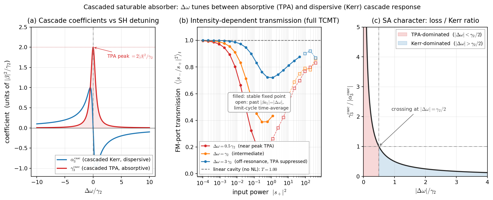{width=92%}

## Validation: TCMT vs adiabatic analytic

Below cascade saturation $|\beta a_1| < |\Delta\omega|$, the full TCMT agrees with the closed-form effective Kerr at machine precision.

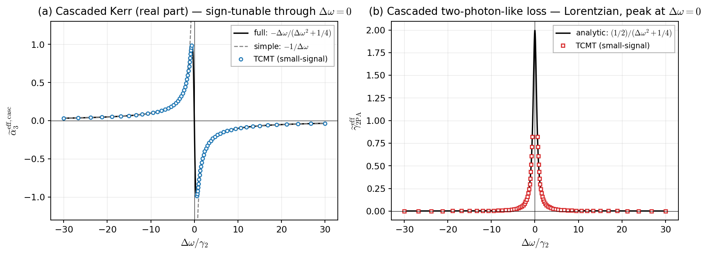{width=80%}

## Bandwidth-enhancement sum rule

Peak enhancement and useful bandwidth trade against each other:

$$\boxed{\;\bigl|\chi^{(3)}_\text{casc}\bigr|_\text{peak} \cdot \Delta f_\text{usable} \;\lesssim\; \frac{\omega_1\,|\chi^{(2)}|^2\,\eta_\text{geom}}{12\pi\,n_2^{\,2}}\;\;\;(\text{Q}_2\text{-independent})\;}$$

::: {.columns}
::: {.column width="55%"}
**Reading:** $Q_2$ pulls a tall narrow Lorentzian out of a fixed area; you cannot beat the sum rule by pushing $Q_2$.

This is the **same rule** that constrains resonant linear absorption (oscillator-strength sum rule) — purely classical.
:::
::: {.column width="45%"}
At $Q_2 = 4{,}000$ in LiNbO$_3$:

- full SH linewidth $\gamma_2/(2\pi) \approx 97\,\text{GHz}$
- usable bandwidth $\sim$ same

Narrowband by Kerr-electronics standards, broadband by photonic-cavity standards.
:::
:::

{width=78%}

# 4. Comparison with native $\chi^{(3)}$ resonance {background-color="#0d2c54" .center}

## The cascade enhancement ratio $R$

Define
$$\boxed{\;R \equiv \frac{|\alpha_3^\text{casc}|}{|\alpha_3^\text{native}|}\;=\;\frac{|\beta|^2}{|\alpha_3|\,|\Delta\omega + i\gamma_2/2|}\;\stackrel{|\Delta\omega|\gg\gamma_2}{\simeq}\;\frac{|\chi^{(3)}_\text{casc}|}{|\chi^{(3)}_\text{native}|}\;}$$

For LiNbO$_3$ at the worked operating point ($Q_2 = 4{,}000$, $\Delta\omega = 2\gamma_2$, $\eta_\text{geom} = 0.3$):

$$|\chi^{(3)}_\text{casc}| \;\sim\; \frac{Q_2}{24\,n_2^{\,2}}\,|\chi^{(2)}|^2\,\eta_\text{geom} \;\simeq\; 2.5 \times 10^{-20}\,\text{m}^2/\text{V}^2 \;\Rightarrow\; \mathbf{R \approx 12}$$

::: {.callout-note}
Pushing $\Delta\omega \to \gamma_2$ (edge of adiabatic validity) raises $R$ to ~20 (full Lorentzian — the often-quoted "$R\sim 25$" is from the simple $1/\Delta\omega$ approximation, which overshoots by ~20% at $\Delta\omega = \gamma_2$).  Loss/Kerr ratio there is $\gamma_2/(2|\Delta\omega|) = 1/2$ — TPA is approximately equal to the cascade-Kerr, a substantial operational penalty.
:::

## SPM phase shift — leverage $(1+R)$ {.smaller}

Steady-state nonlinear phase per input photon at on-resonance critical-coupled pump:

$$\frac{\phi_\text{NL}}{|s_+|^2} = \frac{8\,\alpha_3^\text{eff}}{\gamma_1^2}$$

$$\boxed{\;\frac{\phi_\text{NL}^{\text{A+B}}}{\phi_\text{NL}^\text{A}} = 1 + R\;}$$

**Validity:** $|\beta a_1| \ll |\Delta\omega|$ (small-signal cascade); $|s_+|^2 \ll |\Delta\omega|^2 (\gamma_1/2)^2/(\gamma_1^\text{rad}\beta^2)$.

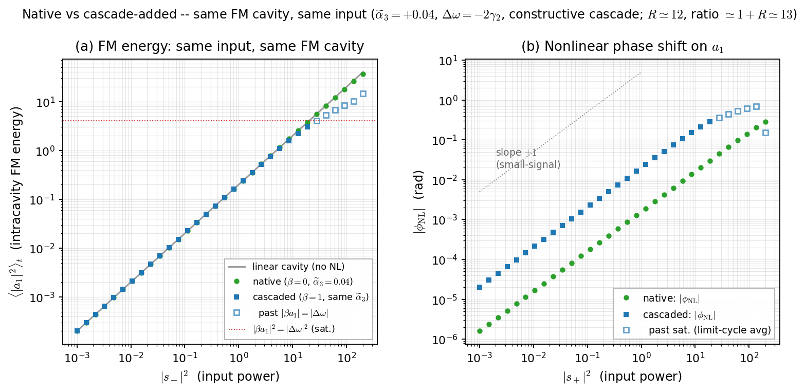{width=88%}

## Bistability threshold — leverage $1/(1+R)$ {.smaller}

For a pump detuned past the bistability threshold $|\delta_p| > \sqrt{3}\,\gamma_1/2$ with $\text{sign}(\delta_p) = -\text{sign}(\alpha_3^\text{eff})$:

$$|s_+|^2_\text{bist} \;\propto\; \frac{\gamma_1^2}{|\alpha_3^\text{eff}|}\;\Rightarrow\;\boxed{\;\frac{|s_+|^{2,\,\text{A+B}}_\text{bist}}{|s_+|^{2,\,\text{A}}_\text{bist}} = \frac{1}{1+R}\;}$$

Same factor controls the **all-optical switching energy**: $E_\text{switch}^\text{A+B}/E_\text{switch}^\text{A} = 1/(1+R)$.

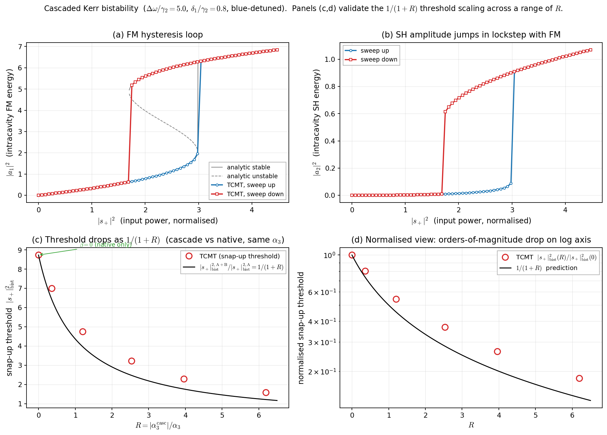{width=82%}

## Four-wave mixing — leverage $(1+R)^2$ {.smaller}

Pump at $\omega_p\approx\omega_1$ + weak signal at $\omega_s = \omega_p - \Omega$ → idler at $\omega_i = \omega_p + \Omega$ inside the FM linewidth.

$$\eta_\text{FWM} \equiv \frac{|s_-^{(i)}|^2}{|s_+^{(s)}|^2} \propto \frac{|\alpha_3^\text{eff}|^2 |a_1^\text{pump}|^4}{(\gamma_1/2)^2}$$

$$\boxed{\;\frac{\eta_\text{FWM}^{\text{A+B}}}{\eta_\text{FWM}^\text{A}} = (1+R)^2\;}$$

**Validity:** $|\Omega| < \min(\gamma_1,\gamma_2)$; small-signal cascade.  $(1+R)^2 = 169$ with $R=12$ at the design point — the **most strongly differentiating** single-observable test.

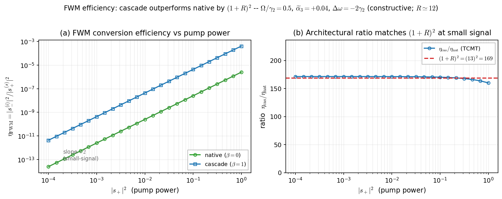{width=85%}

## Cross-phase modulation {.smaller}

Separate weak signal beam (distinguishable polarization or frequency offset) → refractive-index shift driven by pump intensity $|a_1^\text{pump}|^2$:

$$\boxed{\;\frac{\alpha_3^{\text{XPM},\,\text{A+B}}}{\alpha_3^{\text{XPM},\,\text{A}}} = 1+R\,,\quad \alpha_3^\text{XPM} = 2\,\alpha_3^\text{SPM}\;}$$

**Tensor-channel caveat:** $1+R$ holds for tensor contractions where both cascade and native channels are non-vanishing.  In mixed-polarization channels (e.g., $e \to \text{SH} \to o$) the cascade XPM uses different $\chi^{(2)}_{ijk}$ entries than the native XPM channel — verify for the experimental geometry.

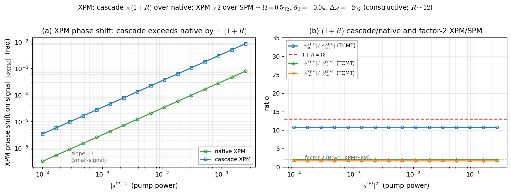{width=85%}

## Sign tunability — *unique to cascade*

$\alpha_3^\text{casc}(\Delta\omega) = -|\beta|^2 \Delta\omega/(\Delta\omega^2 + (\gamma_2/2)^2)$ **changes sign** at $\Delta\omega = 0$:

::: {.columns}
::: {.column width="45%"}
- $\Delta\omega > 0$ → self-defocusing
- $\Delta\omega < 0$ → self-focusing
- $\Delta\omega = 0$ → pure-loss (TPA only)

A single device can be tuned thermo-optically, electro-optically (Pockels on the SH cavity), or by strain — no fabrication swap required.

Native $\chi^{(3)}$ has **no analogue** at any $Q_1$.
:::
::: {.column width="55%"}
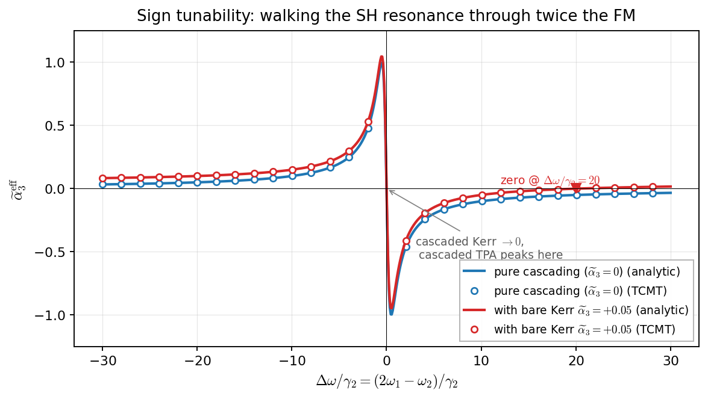{width=100%}
:::
:::

# 5. Cascade-only capabilities {background-color="#0d2c54" .center}

## Saturable absorber (cascaded TPA) {.smaller}

Operating near $\Delta\omega = 0$, the cascaded coefficient is **pure imaginary** — Lorentzian-peaked intensity-dependent loss:

$$\gamma_3^\text{casc}(\Delta\omega=0) = \frac{2|\beta|^2}{\gamma_2} \;\propto\; Q_2$$

**Detunable** unlike intrinsic semiconductor TPA: shift $\omega_2$ by $\gtrsim$ a few $\gamma_2$ to turn the SA off ($\propto 1/\Delta\omega^2$).

Recovery time $\sim 1/\gamma_2 \sim 1\,\text{ps}$ at $Q_2 = 4{,}000$ — faster than SESAM excited-state lifetimes, all-optical, no thermal drift.

{width=92%}

## AM modulator via $\Delta\omega(t)$ {.smaller}

Modulate the SH-cavity detuning (electro-optic / thermo-optic / piezo): $\Delta\omega(t) = \Delta\omega_0 + \delta\Omega \sin(\Omega_\text{mod} t)$ → modulates $\alpha_3^\text{casc}$ → modulates FM-port transmission at fixed pump.

Two transfer-function features (from linearised time-dependent SH eq.):

- **Low-pass roll-off** at $\Omega_\text{mod} \sim \gamma_2/2$  (−3 dB at $\gamma_2/(4\pi)\approx 50$ GHz, $Q_2{=}4{,}000$). Full SH linewidth $\gamma_2/(2\pi)\approx 100$ GHz is the *intrinsic* cascade BW, not the modulator −3 dB.
- **AC resonant peak** at $\Omega_\text{mod} \approx |\Delta\omega_0|$  (validity: $|\Delta\omega_0|\!\gg\!\gamma_2/2$). Peak/DC ratio of the $\alpha_3^\text{eff}$ modulation amplitude is
$$\frac{|\delta\alpha_3^\text{eff}|_\text{peak}}{|\delta\alpha_3^\text{eff}|_\text{DC}} \;=\; \frac{\sqrt{\Delta\omega_0^2 + (\gamma_2/2)^2}}{\gamma_2} \;\xrightarrow[\Delta\omega_0\gg\gamma_2]{}\; \frac{|\Delta\omega_0|}{\gamma_2} \;\simeq\; 2 \;\text{ at }\Delta\omega_0=2\gamma_2.$$

**No native-Kerr analogue:** bulk $\chi^{(3)}$ has no detuning knob. (Electro-optic Pockels modulators exist as a separate class and routinely hit $>100$ GHz — they modulate the *linear* index, not $\alpha_3$. The cascade is uniquely a Kerr-coefficient modulator via a secondary cavity.)

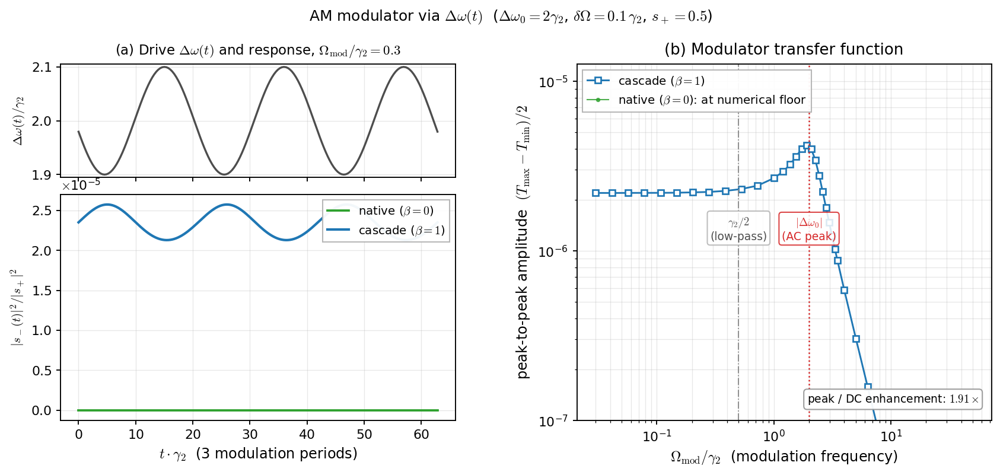{width=92%}

## Passive optical limiter {.smaller}

Cascade saturation $|\beta a_1| \to |\Delta\omega|$ is a **parametric intensity ceiling**:

$$\boxed{\;|a_1|^2_\text{cap} = |\Delta\omega/\beta|^2 \;\propto\; (1/Q_2)^2\;}$$

Above this threshold the trivial fixed point destabilises (OPO threshold) and the FM clamps — excess pump dissipates through cascaded TPA into the heat-sunk SH mode.

**Tunable ceiling:** sweep $\Delta\omega$ quadratically to set the clamp level (laser-safety analogue, all-optical, no thermal load on the FM port).

**What's different from native materials:** native dielectrics *do* have passive intensity limits (TPA in semiconductors, free-carrier absorption near band edge, thermal effects in any high-$Q$ cavity). The distinguishing feature of the cascade is that the clamp is **parametric** (oscillation-threshold) rather than dissipative — heat-sunk into the SH mode rather than thermalised in the FM-port material.

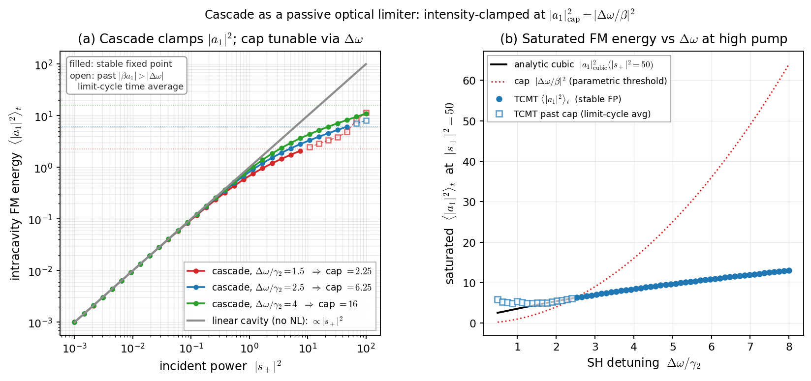{width=92%}

## $\Delta\omega$-readout transducer — sensor {.smaller}

Any perturbation shifting $\omega_2$ (temperature, strain, adsorbed molecules, Pockels via DC field) → shifts $\Delta\omega$ → shifts $\alpha_3^\text{casc}$ → shifts $\phi_\text{NL}$.

::: {.columns}
::: {.column width="58%"}
**Lorentzian-derivative response, $Q_2^{\,2}$ scaling**
$$\frac{d\alpha_3^\text{casc}}{d\Delta\omega} = -|\beta|^2\frac{(\gamma_2/2)^2 - \Delta\omega^2}{(\Delta\omega^2 + (\gamma_2/2)^2)^2}$$

Peak at $\Delta\omega = 0$:
$$\boxed{\;\left|\frac{d\alpha_3^\text{casc}}{d\Delta\omega}\right|_\text{max} \!=\! \frac{4|\beta|^2}{\gamma_2^{\,2}} \;\propto\; \mathbf{Q_2^{\,2}}\;}$$

Two factors of $Q_2$: one from $|\alpha_3^\text{casc}|\propto Q_2$, one from the Lorentzian-derivative slope $\propto 1/\gamma_2 \propto Q_2$.
:::
::: {.column width="42%"}
**Operating-point caveat (on the *same* slide):**
- Peak sensitivity is at $\Delta\omega=0$, which is also the **peak of cascaded TPA loss**. The most sensitive bias is also the lossiest.
- Honest figure of merit: $\text{slope}/\sqrt{\gamma_3^\text{eff}}$. The cascade's $Q_2^{\,2}$ scaling becomes $Q_2^{\,3/2}$ once shot-noise from TPA-dissipated power is folded in — still better than linear-cavity ($Q_2^{\,1/2}$ in this FoM), but **not the naïve $Q_2^{\,2}$**.
- Practical bias: a few $\gamma_2$ off-resonance → $O(1)$ slope drop, $1/\Delta\omega^2$ TPA suppression. $Q_2^{\,2}$ scaling survives this trade-off; prefactor reduces.
:::
:::

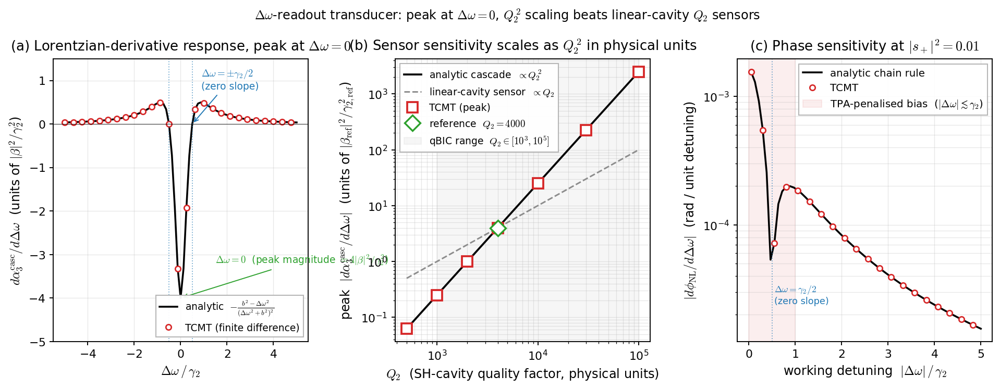{width=98%}

# 6. Feasibility {background-color="#0d2c54" .center}

## Cascade vs native: who wins, by host {.smaller}

$R$ at the conservative design point ($Q_2 = 4{,}000$, $\eta_\text{geom} = 0.3$ assumed for *all materials*, $\Delta\omega = 2\gamma_2$):

| Host | $|\chi^{(2)}|$ [m/V] | $|\chi^{(3)}_\text{native}|$ [m$^2$/V$^2$] | $R$ at $Q_2{=}4\!\times\!10^3$ | $Q_2^\text{crossover}$ |
|------|--------|--------|--------|--------|
| **LiNbO$_3$**  | $5\!\times\!10^{-11}$ | $2\!\times\!10^{-21}$ | $\sim 12$ | $\sim 3\!\times\!10^2$ |
| GaP            | $1\!\times\!10^{-10}$ | $10^{-19}$            | $\sim 0.5$ | $\sim 8\!\times\!10^3$ |
| AlGaAs (near band-edge) | $10^{-10}$ | $10^{-18}$  | $\sim 0.05$ | $\sim 9\!\times\!10^4$ |
| AlN            | $4\!\times\!10^{-12}$ | $2\!\times\!10^{-21}$ | $\sim 0.1$ | $\sim 4\!\times\!10^4$ |
| Si, Si$_3$N$_4$ | $\equiv 0$            | —                     | — | — (no cascade) |

**Caveat:** all $R$ values carry $\pm$ factor-of-2 uncertainty: $\eta_\text{geom}$ is a fabrication-dependent overlap that may not reach 0.3 in every material (especially semiconductors with band-edge proximity); $|\chi^{(3)}_\text{native}|$ has $\sim$50 % dispersion-dependent uncertainty in band-edge materials.  Qualitative ordering (LiNbO$_3$ wins; AlGaAs native wins) is robust.

## Cascade-vs-native by host material

{width=92%}

## Caveats specific to cascade

1. **Cascade-specific loss.** TPA-like coefficient $\gamma_3^\text{eff} = |\beta|^2 \gamma_2 / (2\Delta\omega^2)$ has no analogue in low-loss native LiNbO$_3$.  At fixed phase shift, cascade carries a loss-to-Kerr ratio of $\gamma_2/(2|\Delta\omega|)$.

2. **Lower saturation.**  Cascade saturates at $|\beta a_1| \sim |\Delta\omega|$; max stored energy $\propto 1/Q_2^2$.  Native saturates at thermal / damage limits, orders of magnitude higher.

3. **Fabrication complexity.**  Native needs *one* high-$Q$ resonance; cascade needs *two*, co-localised, with high spatial overlap.

4. **Speed.**  Native Kerr is $\sim$ fs; cascade has bandwidth $\gamma_2$ ($\sim$ ps).  Cascade is locked out of ultrafast applications by its own sum rule.

## Disorder / inhomogeneous broadening {.smaller}

For qBIC SH cavities, $Q_2 \propto 1/\alpha^2$ where $\alpha$ is the meta-atom asymmetry parameter.  Geometric disorder across the array broadens the **array-averaged** SH resonance below the per-element $Q_2$:

$$Q_2^\text{array} \;\sim\; \frac{Q_2^\text{element}}{1 + (Q_2^\text{element}\cdot\sigma_\alpha/\alpha)^2}$$

::: {.columns}
::: {.column width="55%"}
**The single largest practical risk** of the doubly-resonant scheme.

For the headline $R \approx 12$ at $Q_2 = 4{,}000$, you need $Q_2^\text{array} \geq 4{,}000$, i.e., **asymmetry $\sigma_\alpha/\alpha \lesssim 1\%$** across the pump spot.

This is much harder than achieving $Q_2 = 4{,}000$ on a *single* meta-atom — it requires uniformity in sub-nm fabrication of the symmetry-breaking feature (etch depth, hole position, sidewall angle) across the array.
:::
::: {.column width="45%"}
**Mitigations:**

1. **Smaller array footprint** with single-shot e-beam → tight uniformity.
2. **Spatial selectivity**: probe only a sub-region with matched resonance (lattice-disorder spectroscopy).
3. **Adaptive tuning**: thermo-optic uniformity across the array (resistive heaters per meta-atom).
4. **Lower-Q operating point**: $Q_2 = 1{,}000$ is more disorder-tolerant; gives $R \sim 3$ for LiNbO$_3$ — still wins over native.

**?** estimate achievable $\sigma_\alpha/\alpha$ for the fabrication process.
:::
:::

## Dynamic range: only ~1 decade window of usable pump {.smaller}

::: {.columns}
::: {.column width="55%"}
**Operating constraints:**

- **Floor (SNR):** need at least $\phi_\text{NL} \gtrsim 10\,\text{mrad}$ to read out with photodiodes / heterodyne. With $\alpha_3^\text{eff} \sim 0.05$ (LiNbO$_3$) and $\gamma_1 \sim 100$ GHz: floor at $|s_+|^2 \sim 10^{-2}$ in dim TCMT units.

- **Ceiling (saturation):** parametric instability at $|\beta a_1| = |\Delta\omega|$, i.e., $|a_1|^2_\text{sat} = |\Delta\omega|^2 \propto 1/Q_2^{\,2}$. At $\Delta\omega = 2\gamma_2$, $Q_2 = 4{,}000$: $|s_+|^2_\text{sat} \sim 10^{-1}$ in same units.

→ **only ~1 decade between floor and ceiling**.

Pushing $Q_2$ higher *simultaneously* squeezes the ceiling down quadratically. A $Q_2 = 10^5$ design has $R \approx 30$, but a $10^{-3}$-decade pump window — operationally unusable.
:::
::: {.column width="45%"}
**Implication:** there is a "sweet $Q_2$" where the cascade leverage is large enough to detect, but the dynamic range is still operational.

For LiNbO$_3$:
- $Q_2 = 1{,}000$: $R \approx 3$, 3-decade pump window
- $Q_2 = 4{,}000$: $R \approx 12$, 1-decade pump window
- $Q_2 = 10{,}000$: $R \approx 30$, 0.3-decade pump window
- $Q_2 = 10^5$: $R \approx 300$, 0.03-decade — not usable

The conservative $Q_2 = 4{,}000$ design is **already at the edge** of the practical dynamic-range trade-off.

For applications that require the full $R$ leverage simultaneously with multi-decade dynamic range, a $\chi^{(2)}$-active host with **larger** $|\chi^{(2)}|$ (boosting $|\beta|$, hence $R$ at fixed $Q_2$) is the right move, *not* higher $Q_2$.
:::
:::

# 7. Key design parameters {background-color="#0d2c54" .center}

## Hierarchy of design knobs {.smaller}

In order of decreasing leverage on $|\chi^{(3)}_\text{casc}|$:

::: {.columns}
::: {.column width="50%"}
1. **$\eta_\text{geom}$** — the dimensionless modal overlap

  $$\eta_\text{geom} \equiv \frac{|\!\int\!\chi^{(2)}_{ijk} f_{2,i}^* f_{1,j} f_{1,k} d^3r|^2 / V}{\int|\mathbf{f}_1|^4 d^3r}$$

2. **$|\chi^{(2)}|$** of the host — enters squared.  LiNbO$_3$ vs AlGaAs is a factor 2.
:::
::: {.column width="50%"}
3. **$Q_2 / n_2^{\,2}$** — $1/n_2^{\,2}$ is fixed by material; $Q_2$ is the design knob.
   - Factor of 2 in $Q_2$ → factor of 2 in peak height.
   - Factor of 2 in $Q_2$ → factor of 2 cut in bandwidth (sum rule).
   - Factor of 2 in $Q_2$ → factor of 4 cut in saturation power.

4. **$\Delta\omega$ operating point** — controls Kerr-vs-TPA mix, sign, and validity.  Three regimes:
   - $\Delta\omega = 2\gamma_2$: conservative, fully adiabatic, $R \approx 12$.
   - $\Delta\omega = \gamma_2$: edge of validity, $R \approx 20$ (full Lorentzian) but TPA/Kerr ratio $\sim 1/2$.
   - $\Delta\omega = 0$: pure SA, no Kerr.
:::
:::

## Geometric overlap is the binding constraint

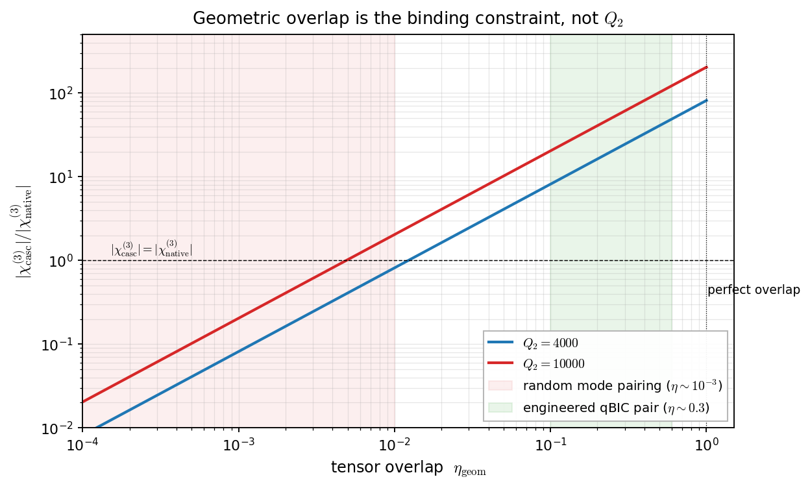{width=82%}

## Design-space heatmap

![Phase-bandwidth design map for LiNbO$_3$ as a function of $(Q_1, Q_2)$. Diagonal contours = constant phase-bandwidth product (sum-rule lines). Practical qBIC range $Q_1, Q_2 \in [10^2, 10^5]$.](../cascaded_chi3/figures/phase_shift_per_pump_2d.png){width=92%}

## Practical trade-offs {.smaller}

| You want… | Trade-off | Mitigation |
|-----------|-----------|------------|
| Higher $|\chi^{(3)}_\text{casc}|$ | narrower BW; lower saturation | higher $Q_2$; active cooling |
| Wider BW | lower peak; more pump for same $\phi$ | moderate $Q_2$ |
| Faster temporal response | loses cascade enhancement at $\sigma_t \gamma_2 \lesssim 1$ | switch to bulk PPLN regime |
| Sign tunability w/o swap | fine $\Delta\omega$ control | thermo-optic / Pockels tuning |
| Avoid OPO threshold | operate below $|\beta a_1| \sim |\Delta\omega|$ | larger $\Delta\omega$, lower pump |
| Avoid thermal confusion | absorption → heating | LiNbO$_3$ over GaAs |
| Suppress cascaded TPA | TPA peaks at $\Delta\omega = 0$ | operate at $|\Delta\omega| \gtrsim 2\gamma_2$ |

# 8. Summary and asks {background-color="#0d2c54" .center}

## Summary of observable leverage {.smaller}

| Observable | (A+B)/A ratio | Comment |
|------------|--------------|---------|
| SPM phase shift | $1+R$ | Foundational, $R \approx 12$ for LiNbO$_3$ |
| XPM phase shift | $1+R$ | Same $R$; tensor-channel caveat |
| Bistability threshold | $1/(1+R)$ | Switching energy savings $\sim 13\times$ |
| FWM conversion efficiency | $(1+R)^2$ | $\sim 170\times$ — most differentiating |
| Saturable absorber rate | n/a | Cascade-only, $\Delta\omega$-tunable |
| AM modulator response | n/a | Cascade-only, $\sim$100 GHz |
| Optical-limiter clamp | $\sim (\Delta\omega/\beta)^2$ | Cascade-only, passive ceiling |
| Sensor sensitivity | $\propto Q_2^{\,2}$ | Cascade-only; beats linear-cavity $Q_2$ |

## Which experiment first? {.smaller}

Not all applications are equal as "first demos":

| Application | Leverage | Verdict |
|---|---|---|
| **FWM** | $(1+R)^2 \approx 170$ | **Strongest cascade signature.** Clean cw measurement (heterodyne idler power). Narrowband ($\Omega < \gamma_2$) but that's a feature not a bug for a demo. |
| **Sensor (Q₂²)** | $\propto Q_2^{\,2}$ | **Cleanest scaling claim.** Q₂² is unambiguous if measured across multiple Q₂'s.  Caveat: lossy-bias operating point. |
| SPM | $1+R$ | Hardest to measure cleanly (phase noise, drift). Not differentiating from other Kerr cavities. |
| Bistability | $1/(1+R)$ | A $13\times$ threshold drop can come from many things (better $Q_1$, thermal). Not unambiguously a cascade signature. |
| SA | new capability | Competes with SESAMs at similar BW. Cascade tunability is the unique feature, hard to sell as a first demo. |
| AM modulator | new capability | Competes with $>100$ GHz Pockels modulators. Cascade is qualitatively different physics but not better performance. |
| Optical limiter | new capability | Competes with TPA / free-carrier limiters. Cascade is parametric not dissipative — interesting but niche. |

::: {.callout-tip}
**Opinion:** the first experiment should be one whose positive outcome is simultaneously (1) unambiguous evidence of the cascade mechanism and (2) a real performance gain over the next-best alternative.

**FWM and the sensor are the only two that satisfy both.** AM/SA/limiter are interesting capabilities, but a "first demo" of those competes with mature technologies that are likely to outperform on the metrics that matter.
:::

## Should we do this experimentally? {.smaller}

::: {.columns}
::: {.column width="50%"}
**Pros**

- ~order-of-magnitude $\chi^{(3)}$ enhancement on a *standard* low-loss host (LiNbO$_3$).
- Several capabilities (AM, SA, limiter, sensor) **native cannot match**.
- All in a chip-scale dielectric metasurface, no exotic materials.
- Builds on existing high-$Q$ qBIC metasurface platforms — same fabrication.
:::
::: {.column width="50%"}
**Cons / open questions**

- Doubly-resonant fabrication: $Q_2$ uniformity across the array matters.
- Cascade TPA penalty in low-loss hosts (no native analogue).
- Bandwidth $\sim$ 100 GHz — not for ultrafast applications.
- The "killer demo" depends on which capability we prioritise (FWM has highest leverage; sensor has cleanest theoretical claim).
:::
:::

## Questions {.smaller}

1. **Target SH-mode platform** — symmetry-protected BIC or strongly under-coupled qBIC at $\omega_2 \approx 2\omega_1$.  Aim for $Q_2 \gtrsim 4{,}000$; sensitivity in some applications scales as $Q_2^{\,2}$.

2. **Co-localisation** — both modes must share a meta-atom volume with high tensor overlap.  Target $\eta_\text{geom} \gtrsim 0.1$.  Random pairings give $\eta \sim 10^{-3}$, which kills the cascade.

3. **Tensor channel** — for LiNbO$_3$ (point group $3m$): exploit $d_{33}$ with field along the optic axis (z-cut, e-polarised modes).  Confirm the chosen polarisation geometry gives non-vanishing $\int\chi^{(2)}_{ijk} f_{2,i}^* f_{1,j} f_{1,k}$.

4. **$\Delta\omega$ tuning mechanism** — electro-optic (Pockels, ~GHz/V), thermo-optic ($\sim 1.5$ GHz/K), or strain.  Need $\sim$few $\gamma_2$ of tuning range ($\sim 300$ GHz at $Q_2 = 4{,}000$).

5. **FM port** — moderate $Q_1 \sim 10^2$–$10^3$ for efficient in-coupling.  Critical / over-coupled at $\omega_1$ depending on application (over-coupled for SA / limiter, critical for bistability).

<!-- ## Next steps -->
<!---->
<!-- ::: {.columns} -->
<!-- ::: {.column width="50%"} -->
<!-- **Theory** -->
<!---->
<!-- - Lugiato–Lefever extension for cascade-mediated frequency combs (multi-mode TCMT). -->
<!-- - Squeezed-light / OPO regime (quantum input-output). -->
<!-- - Disorder / inhomogeneous broadening of $\gamma_2$ across the array. -->
<!-- ::: -->
<!-- ::: {.column width="50%"} -->
<!-- **Experiment** -->
<!---->
<!-- - Pick the **first demo**: FWM (largest leverage), sensor ($Q_2^2$ clean claim), or bistability (low switching energy)? -->
<!-- - Cross-host comparison: LiNbO$_3$ vs (future) GaP at the same geometry. -->
<!-- - Characterisation: pump-probe at telecom; heterodyne phase readout. -->
<!-- ::: -->
<!-- ::: -->
<!---->
<!-- ::: {.callout-tip} -->
<!-- **Decision point for the PI:**  is the cascade worth a fabrication run for the first demo, or do we want a paper-only theory exposition?  Inputs needed: estimated $Q_2$ from the metasurface group, projected pump powers, comparison target (native LiNbO$_3$ benchmark or AlGaAs). -->
<!-- ::: -->
<!---->
<!-- ## Thank you {.center} -->
<!---->
<!-- Questions, comments, asks. -->
<!---->
<!-- Pointer document: project note `Cascaded_chi3_metasurface_note.tex` (theory) + `cascaded_chi3_simulation_report.tex` (figures + TCMT validation). -->
